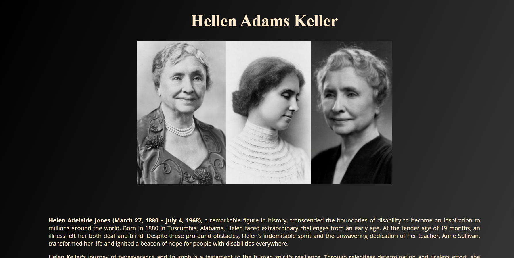

# Tribute Page

This is a simple HTML file for a tribute page dedicated to Helen Keller. The page contains information about Helen Keller's life, achievements, and contributions to society.

## Features
- **Title:** The page title is "Tribute Page".
- **Header:** The header contains the title "Hellen Adams Keller".
- **Image:** An image of Helen Keller is displayed under the header.
- **Biography:** The biography section provides a brief overview of Helen Keller's life, highlighting her challenges, achievements, and contributions.
- **Quotes:** A quote by Helen Keller is displayed along with the biography.
- **Link:** A link to Helen Keller's Wikipedia page is provided for those interested in reading more about her.

## Photo

## License
This tribute page is for educational purposes and personal use only. Redistribution or commercial use of the content without proper permission is prohibited.

## Link
[Demo](https://tribute-page-gray-eta.vercel.app/)
